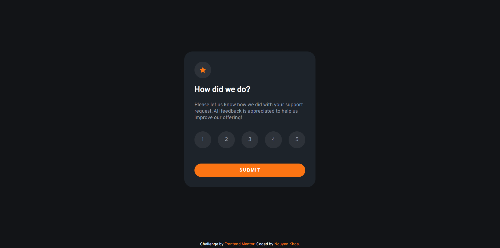
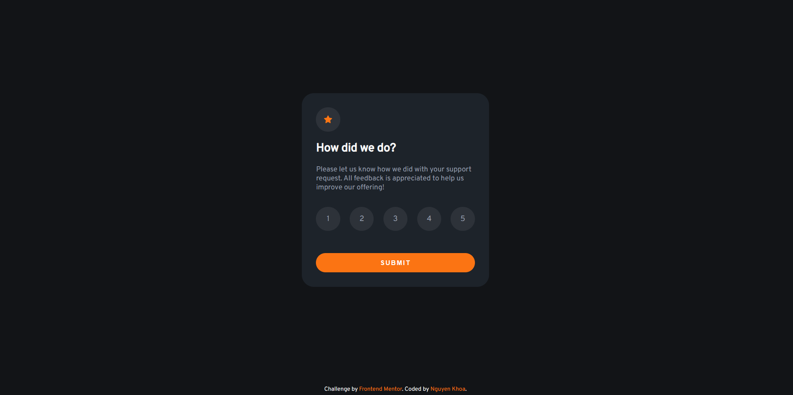
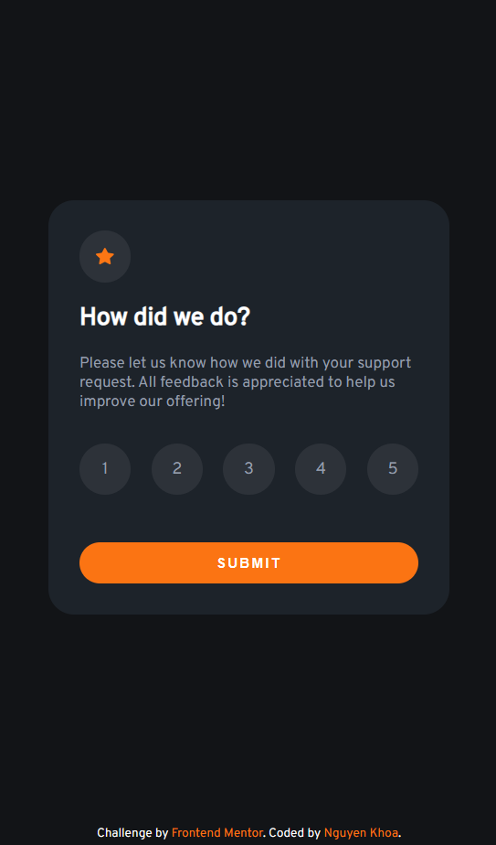
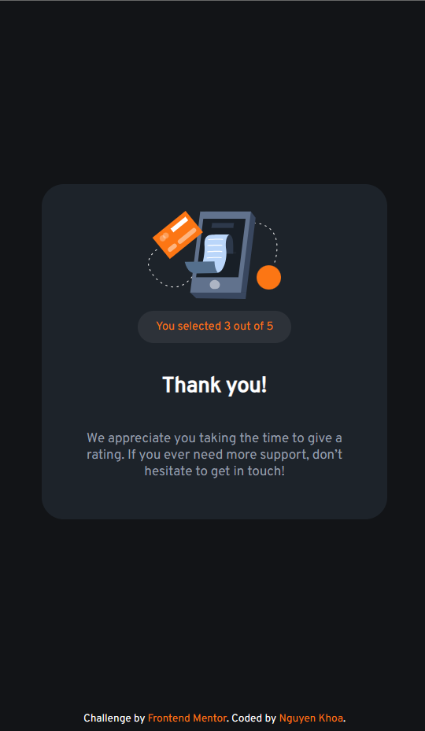

# Frontend Mentor - Interactive rating component solution

This is a solution to the [Interactive rating component challenge on Frontend Mentor](https://www.frontendmentor.io/challenges/interactive-rating-component-koxpeBUmI). Frontend Mentor challenges help you improve your coding skills by building realistic projects.

## Table of contents

- [Overview](#overview)
  - [The challenge](#the-challenge)
  - [Screenshot](#screenshot)
  - [Links](#links)
- [My process](#my-process)
  - [Built with](#built-with)
  - [What I learned](#what-i-learned)
  - [Continued development](#continued-development)
- [Author](#author)

**Note: Delete this note and update the table of contents based on what sections you keep.**

## Overview

### The challenge

Users should be able to:

- View the optimal layout for the app depending on their device's screen size
- See hover states for all interactive elements on the page
- Select and submit a number rating
- See the "Thank you" card state after submitting a rating

### Screenshot

### Links

- Solution URL: [https://github.com/NguyenVanKhoa-CDTH19PMC/interactive-rating-component.git](https://github.com/NguyenVanKhoa-CDTH19PMC/interactive-rating-component.git)
- Live Site URL: [https://nguyenvankhoa-cdth19pmc.github.io/interactive-rating-component/](https://nguyenvankhoa-cdth19pmc.github.io/interactive-rating-component)

## My process

### Built with

- Semantic HTML5 markup
- CSS custom properties
- Flexbox
- Mobile-first workflow
- Javascript

### Continued development

Improve HTML, CSS and JavaScript skills

## Author

- Frontend Mentor - [@NguyenVanKhoa-CDTH19PMC] (https://www.frontendmentor.io/profile/NguyenVanKhoa-CDTH19PMC)
- Github - [NguyenVanKhoa-CDTH19PMC] (https://github.com/NguyenVanKhoa-CDTH19PMC)
